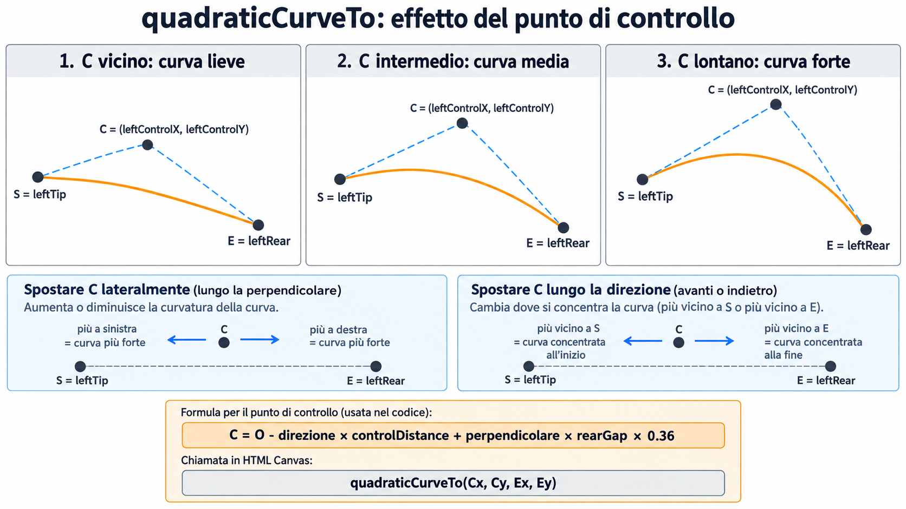

### Wave Lines algorithm

Coordinate Canvas:

x →
y ↓

        P ●  (leftX, leftY)
           ╲
            ╲     ramo sinistro della scia
             ╲
        C × · · ╲
          punto   ╲
          di       ● S  (leftTipX, leftTipY)
          controllo│
                   │ tipGap
                   └──────── ● T  (tipX, tipY)
                              │
                              │ tipDistance
                              │
                              ● O  (wave.x, wave.y)
                              ↓
                       movimento del mouse

