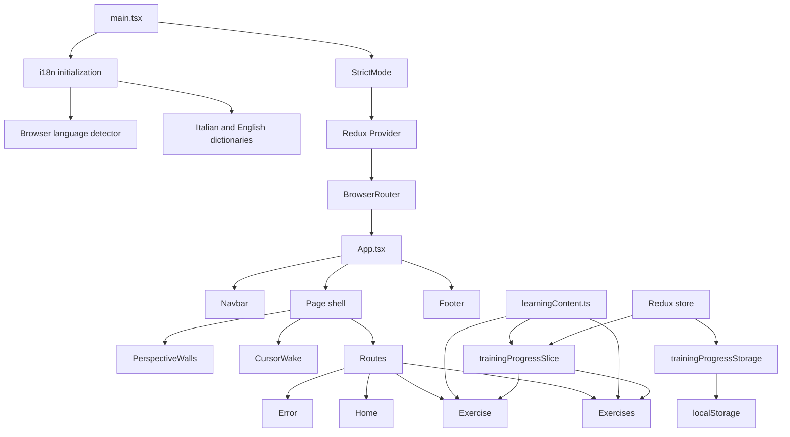
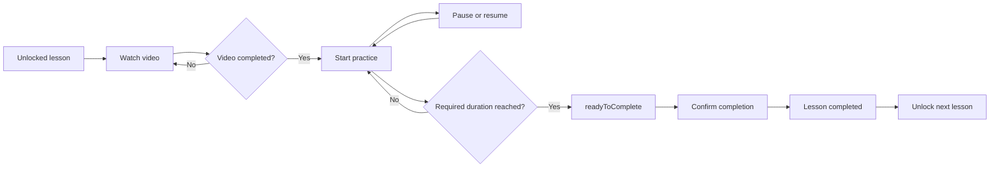

# MeditActive

[](https://react.dev/)
[](https://vite.dev/)
[](https://www.typescriptlang.org/)
[](https://redux-toolkit.js.org/)
[](https://getbootstrap.com/)
[](https://sass-lang.com/)
[](https://vitest.dev/)
[](https://playwright.dev/)

<p align="center">
  
</p>

A React application dedicated to meditation, body awareness, and the gradual development of a personal practice.

MeditActive is a responsive **Single Page Application** that provides progressive video lessons, timed practice, completion tracking, and local progress persistence. The interface combines educational content, visual feedback, and a sequential path in which each exercise unlocks the next one.

---

## Table of contents

1. [Project overview](#1-project-overview)
2. [Technology stack](#2-technology-stack)
3. [Core features](#3-core-features)
4. [High-level architecture](#4-high-level-architecture)
5. [Directory structure](#5-directory-structure)
6. [Application routing](#6-application-routing)
7. [Redux state management](#7-redux-state-management)
8. [Exercise data model](#8-exercise-data-model)
9. [Lesson flow](#9-lesson-flow)
10. [Persistence and synchronization](#10-persistence-and-synchronization)
11. [Main components](#11-main-components)
12. [Main pages](#12-main-pages)
13. [Styling, responsive design, and animations](#13-styling-responsive-design-and-animations)
14. [Metadata and accessibility](#14-metadata-and-accessibility)
15. [Internationalization](#15-internationalization)
16. [Testing](#16-testing)
17. [Installation and commands](#17-installation-and-commands)
18. [Application flows](#18-application-flows)
19. [Technical notes and possible improvements](#19-technical-notes-and-possible-improvements)
20. [Appendix: Canvas effect](#appendix-canvas-effect)

---

## 1. Project overview

**MeditActive** combines meditation, awareness, and personal-growth tools in an experience designed to be easy to use.

The application allows users to:

- learn about the project's goals, vision, and mission;
- browse a foundational body-awareness course;
- follow video exercises focused on breathing, posture, and foot placement;
- access lessons in a progressive order;
- start, pause, and resume a timed practice session;
- check lesson status through a progress bar;
- preserve progress across reloads and browser sessions;
- synchronize state across multiple tabs in the same browser;
- read the localized navigation, Home, and lesson content in Italian or English according to the browser preferences;
- see a dedicated error page for unknown routes or locked lessons.

The project is also a practical exercise in:

- React component composition;
- static and dynamic routing;
- state modeling with Redux Toolkit;
- side effects and timers implemented through hooks;
- browser persistence;
- TypeScript and typed data;
- responsive layouts with Bootstrap and Sass;
- internationalization with browser-language detection;
- unit, integration, and end-to-end testing;
- accessibility, social metadata, and structured data.

---

## 2. Technology stack

| Technology                        | Role in the project                                      |
| -------------------------------- | -------------------------------------------------------- |
| React 19                          | Functional components and UI rendering                   |
| TypeScript                        | Typing for components, data, Redux, and utilities        |
| Vite                              | Development server and frontend tooling                  |
| React Router DOM                  | SPA navigation and dynamic routes                        |
| Redux Toolkit                     | Shared state for the training path                       |
| React Redux                       | Typed connection between the store and components        |
| i18next                           | Translation resources, fallback, and language resolution |
| react-i18next                     | React hooks and rich translated content                  |
| i18next-browser-languagedetector  | Browser-language detection                               |
| Bootstrap 5                       | Grid, responsive utilities, and visual components        |
| Sass / CSS                        | Variables, media queries, animations, and customization  |
| Canvas 2D API                     | Decorative effect associated with pointer movement       |
| Web Storage API                   | Local persistence and cross-tab synchronization          |
| Vitest                            | Unit tests in a `jsdom` environment                      |
| Testing Library                   | Rendering and interaction in component and hook tests    |
| Playwright                        | End-to-end tests across multiple browsers                |

The `package.json` file also contains dependencies intended for future development. This table lists only the technologies currently used by the application.

---

## 3. Core features

### Home page

The landing page presents:

- the identity and purpose of MeditActive;
- the problem being addressed, the vision, and the mission;
- responsive illustrations;
- entrance animations activated through `IntersectionObserver`.

### Exercise path

The course contains five ordered sections. The first one is immediately available, while each subsequent section is unlocked by completing the previous lesson.

The cards display:

- the lesson title and preview;
- lock status;
- video status;
- practice status;
- exercise completion.

### Video and timed practice

Each lesson requires two stages:

1. watching the complete video;
2. completing a timed practice that can be paused and resumed.

The application measures the video time that was actually played through `HTMLMediaElement.played`, so seeking along the timeline does not automatically count as completion.

Before its first playback, each lesson video uses a slow, non-intrusive attention animation. The Redux `videoBlink` flag starts as `true`; the first accepted `startVideoPlayback` action changes it to `false`, removes the `video-enlarge` class, and prevents the animation from being restored during later playback sessions.

### Sequential progression

Completing a section:

- changes its status to `completed`;
- preserves the lesson history;
- unlocks only the section identified by `nextSectionId`;
- handles the final course section correctly.

### Responsive experience

On small screens, the application uses a shell as tall as the viewport:

- the navbar remains at the bottom;
- the central content area handles vertical scrolling;
- the layout adapts through the Bootstrap grid and dedicated media queries.

### Multilingual interface

The navigation, footer, Home content, course and lesson content, related accessibility labels, and selected page metadata are available in Italian and English. The initial language is selected from the browser preferences, with Italian used as the fallback for unsupported languages.

---

## 4. High-level architecture

The frontend architecture is organized around pages, components, data, and shared state.


```mermaid
flowchart TD
    A[main.tsx] --> B[StrictMode]
    A --> U[i18n initialization]
    U --> V[Browser language detector]
    U --> W[Italian and English dictionaries]
    B --> C[Redux Provider]
    C --> D[BrowserRouter]
    D --> E[App.tsx]

    E --> F[Navbar]
    E --> G[Page shell]
    E --> H[Footer]

    G --> I[PerspectiveWalls]
    G --> J[CursorWake]
    G --> K[Routes]

    K --> L[Home]
    K --> M[Exercises]
    K --> N[Exercise]
    K --> O[Error]

    P[learningContent.ts] --> M
    P --> N
    P --> Q[trainingProgressSlice]

    R[Redux store] --> Q
    Q --> M
    Q --> N
    R --> S[trainingProgressStorage]
    S --> T[localStorage]
```

### Main responsibilities

| Layer                  | Responsibility                                                |
| ---------------------- | ------------------------------------------------------------- |
| `main.tsx`             | Mounts React, Redux, and React Router                         |
| `i18n/`                | Initializes language detection and exposes translation resources |
| `App.tsx`              | Defines the shell, decorations, navigation, routes, and footer |
| `pages/`               | Composes the pages associated with routes                     |
| `components/`          | Contains reusable UI and behavior                             |
| `data/`                | Contains static lesson structure, assets, and metadata        |
| `store/`               | Manages state, timers, persistence, and typed Redux hooks     |
| `public/videos/`       | Exposes lesson videos as public assets                        |
| `public/robots.txt`    | Defines crawler rules                                         |
| `public/sitemap.xml`   | Lists public pages proposed to search engines                 |
| `tests/`               | Contains Playwright end-to-end tests                          |

---

## 5. Directory structure

```text
MeditActiveReact/
├── docs/
│   └── curvature_regulation.png
├── public/
│   ├── videos/
│   ├── robots.txt
│   └── sitemap.xml
├── scripts/
│   └── ensure-linux-install.mjs
├── skills/
│   └── imagegen/
│       └── SKILL.md
├── src/
│   ├── assets/
│   │   ├── fonts/
│   │   └── img/
│   ├── components/
│   │   ├── exercise/
│   │   │   ├── article.tsx
│   │   │   ├── exerciseCard.tsx
│   │   │   └── exerciseView.tsx
│   │   ├── cursorWake.tsx
│   │   ├── footer.tsx
│   │   ├── navbar.tsx
│   │   ├── pageMetadata.tsx
│   │   ├── perspectiveWalls.tsx
│   │   ├── progressBar.tsx
│   │   └── title.tsx
│   ├── data/
│   │   ├── homeConcepts.tsx
│   │   ├── learningContent.ts
│   │   └── pageMetadata.ts
│   ├── i18n/
│   │   ├── locales/
│   │   │   ├── en/
│   │   │   │   └── translation.json
│   │   │   └── it/
│   │   │       └── translation.json
│   │   ├── config.test.js
│   │   ├── config.ts
│   │   └── index.ts
│   ├── pages/
│   │   ├── error.tsx
│   │   ├── exercise.tsx
│   │   ├── exercises.tsx
│   │   └── home.tsx
│   ├── store/
│   │   ├── hooks.ts
│   │   ├── store.ts
│   │   ├── timerHooks.ts
│   │   ├── trainingProgressSlice.ts
│   │   └── trainingProgressStorage.ts
│   ├── App.tsx
│   └── main.tsx
├── tests/
├── eslint.config.js
├── index.html
├── package.json
├── playwright.config.js
├── tsconfig.json
├── vite.config.js
└── vitest.config.js
```

The `node_modules/`, `dist/`, `test-results/`, and `playwright-report/` directories are generated by development tools and are not part of the source code.

---

## 6. Application routing

Routing is defined in `App.tsx` through `Routes` and `Route`.

```tsx
<Routes>
  <Route path="/" element={<Home />} />
  <Route path="/exercises" element={<Exercises />} />
  <Route path="/exercise/:sectionId" element={<Exercise />} />
  <Route path="*" element={<Error />} />
</Routes>
```

| Route                  | Component   | Purpose                                       |
| ---------------------- | ----------- | --------------------------------------------- |
| `/`                    | `Home`      | Introduces MeditActive                        |
| `/exercises`           | `Exercises` | Lists lessons and path status                 |
| `/exercise/:sectionId` | `Exercise`  | Displays the lesson identified by the section |
| `*`                    | `Error`     | Handles unknown routes                        |

The `Exercise` page validates `sectionId` through `isSectionId()`. If the identifier does not exist or the section is still locked, the error page is displayed.

---

## 7. Redux state management

Shared state is managed by Redux Toolkit in the `trainingProgress` domain.

```ts
interface TrainingProgressState {
  progressBySectionId: Record<SectionId, SectionTrainingProgress>;
  activeSectionId: SectionId | null;
}
```

### Section state

| Property               | Meaning                                                 |
| ---------------------- | ------------------------------------------------------- |
| `videoCompleted`       | Whether the complete video has been watched             |
| `videoCurrentSecond`   | Saved current video position                            |
| `videoWatchedSeconds`  | Time that was actually played                           |
| `videoDurationSeconds` | Detected video duration                                 |
| `videoBlink`           | Whether the initial video attention animation is active |
| `elapsedTrainingMs`    | Practice time already accumulated                       |
| `requiredTrainingMs`   | Duration required by the lesson configuration           |
| `startedAtMs`          | Start timestamp of the current session                  |
| `status`               | Current practice status                                 |
| `trainingCompleted`    | Permanent lesson-completion flag                        |
| `isLocked`             | Whether the lesson is unavailable in the path           |

Possible practice states are:

```text
idle → running → paused → running → readyToComplete → completed
```

### Main actions

| Action                        | Responsibility                                             |
| ----------------------------- | ---------------------------------------------------------- |
| `setVideoProgress`            | Saves position, played time, and duration                  |
| `setVideoCompleted`           | Validates actual video completion                          |
| `startVideoPlayback`          | Records the active section and disables `videoBlink`       |
| `stopVideoPlayback`           | Releases the active section                                |
| `startTraining`               | Starts or resumes practice                                 |
| `pauseTraining`               | Saves the elapsed time for the current session             |
| `setReadyToBeCompleted`       | Moves the practice to the confirmation stage               |
| `completeTraining`            | Completes the lesson and unlocks the next one               |
| `resetTraining`               | Resets the timer of a completable or completed practice    |
| `synchronizeTrainingProgress` | Applies state received from another tab                    |

`activeSectionId` prevents multiple sections from running concurrently in the same shared state.

---

## 8. Exercise data model

Static content is defined in `src/data/learningContent.ts` and remains separate from Redux state.

```ts
interface ExerciseSection {
  readonly id: SectionId;
  readonly exerciseId: string;
  readonly title: string;
  readonly description: string;
  readonly videoUrl: string;
  readonly thumbnailUrl: string;
  readonly requiredTrainingMs: number;
  readonly nextSectionId: SectionId | null;
}
```

### Modeling decisions

- `as const` preserves identifiers as literal types;
- `SectionId` is derived directly from the data;
- `exerciseSectionById` provides fast lookup by identifier;
- `isSectionId()` acts as a type predicate;
- `nextSectionId` describes progression without duplicating logic;
- static content and user progress remain separate.

The current path includes exercises for breathing while lying down, breathing while standing, and awareness of foot placement.

---

## 9. Lesson flow


```mermaid
flowchart LR
    A[Unlocked lesson] --> B[Watch video]
    B --> C{Video completed?}
    C -- No --> B
    C -- Yes --> D[Start practice]
    D --> E[Pause or resume]
    E --> D
    D --> F{Required duration reached?}
    F -- No --> D
    F -- Yes --> G[readyToComplete]
    G --> H[Confirm completion]
    H --> I[Lesson completed]
    I --> J[Unlock next lesson]
```

### Timer

The `useTrainingTimer()` hook:

- creates an interval only while the status is `running`;
- updates elapsed time once per second;
- combines previously saved time with the current session;
- caps the total at the required duration;
- dispatches `setReadyToBeCompleted` when the threshold is reached;
- clears the interval when paused, when switching sections, and when unmounted.

### Progress bar

`ProgressBar` displays four milestones:

```text
Start → Video → Practice → Completed
```

The value is passed to CSS through the `--progress-value` custom property.

---

## 10. Persistence and synchronization

Progress is stored under the following key:

```text
meditactive-training-progress
```

### Writing

The store registers a subscriber that serializes `trainingProgress` after each meaningful change.

```text
dispatch
  ↓
reducer
  ↓
new Redux state
  ↓
store.subscribe
  ↓
JSON.stringify
  ↓
localStorage
```

Write errors are caught so that a browser storage problem does not prevent the interface from updating.

### Reading

At startup, `loadTrainingProgress()` retrieves the saved JSON. If the key is missing or its content is invalid, Redux uses the initial state.

### Multiple tabs

The `storage` event listener receives updates from other tabs and dispatches `synchronizeTrainingProgress()`.

---

## 11. Main components

### `Navbar`

Handles navigation to Home and Exercises through `NavLink`, including active state and `aria-current`. On mobile, it is positioned at the bottom of the shell.

### `Footer`

Contains contact information and social links. It is shared by every route.

### `Title`

Standardizes headings, colors, size, alignment, and animated decorations while keeping the semantic level configurable from `h1` to `h6`.

### `ExerciseCard` and `Article`

Represent a course section. Unlocked lessons become accessible links, while locked lessons remain non-navigable informational elements.

### `ExerciseView`

Coordinates:

- the video and its DOM events;
- verification of the time actually watched;
- the one-time video attention animation;
- Redux state;
- the practice timer;
- start, pause, reset, and completion buttons;
- the progress bar;
- navigation to the next section.

### `PageMetadata`

Updates the title, description, robots directive, canonical URL, Open Graph metadata, and organization JSON-LD.

### `PerspectiveWalls` and `CursorWake`

Create the application's decorative layer. The perspective walls are purely visual; the canvas responds to pointer movement without causing a React re-render on every frame.

---

## 12. Main pages

### `Home`

Introduces MeditActive through data-driven content. Sections are animated once when they enter the viewport; they remain visible when `IntersectionObserver` is unavailable.

### `Exercises`

Displays the course and generates cards from `exerciseSections`.

### `Exercise`

Reads `sectionId` from the URL, validates the section, checks its lock, and creates lesson-specific metadata before rendering `ExerciseView`.

### `Error`

Handles unknown routes, invalid identifiers, and direct access to locked sections. It uses an illustration consistent with the MeditActive style and `noindex, nofollow` metadata.

---

## 13. Styling, responsive design, and animations

Styles are organized into Sass source files and their corresponding CSS files:

| File                  | Responsibility                                  |
| --------------------- | ----------------------------------------------- |
| `Colors.scss`         | Main color palette                              |
| `BootstrapVars.scss`  | Bootstrap customization and inclusion          |
| `Navbar.scss`         | Desktop and mobile navigation                   |
| `CustomElements.scss` | Cards, progress bar, and custom components      |
| `Animations.scss`     | Reveals, decorative layers, and animations      |
| `App.scss`            | Utilities and global rules                      |
| `App.css`             | CSS imported by the application                 |

### Palette

| Color       | Value     | Usage                                |
| ----------- | --------- | ------------------------------------ |
| Orange      | `#e26a08` | Secondary color and actions          |
| Dark green  | `#3b6a4f` | Text, images, and natural atmosphere |
| Light green | `#7fc87b` | Accents and illustrations            |
| Cream       | `#fae3c0` | Backgrounds and progress bar         |
| Warm black  | `#241d18` | Text and contrast                    |

### Video attention animation

The `video-enlarge` class applies the slow `videoEnlarge` scale animation before a lesson video is played for the first time. The class is driven by `videoBlink` and removed after the first accepted play event. Pausing or replaying the video does not restore it.

### Mobile layout

On mobile, `.app-shell` occupies `100dvh`; the navbar is a non-shrinking flex item and `.page-scroll-container` handles vertical scrolling. This structure keeps navigation visible without covering the content.

### Reduced motion

Animations respect `prefers-reduced-motion`. The canvas is activated only when a precise pointer and hover are available and the user has not requested reduced motion.

---

## 14. Metadata and accessibility

Each page defines dedicated metadata:

- title;
- description;
- robots directive;
- canonical URL when applicable;
- Open Graph properties;
- social image and alternative text.

The Home page also adds `Organization` structured data in JSON-LD format.

### Canonical domain

Absolute metadata URLs use the following production origin:

```text
https://medit-active.web.app
```

The domain is used for canonical URLs, `og:url`, Open Graph images, and URLs inside JSON-LD. During development, the application continues to run at `http://localhost:5173`: navigation and local resources stay on the developer's machine, while SEO metadata intentionally declares the production site as the canonical version.

If a custom domain is configured, the origin in `src/components/pageMetadata.tsx`, `public/robots.txt`, and `public/sitemap.xml` must be updated consistently.

### Robots and sitemap

Vite copies `public/robots.txt` to the bundle root. It contains:

```text
User-agent: *
Allow: /

Sitemap: https://medit-active.web.app/sitemap.xml
```

- `User-agent: *` applies the rules to every crawler;
- `Allow: /` permits crawling of the entire site;
- `Sitemap` communicates the XML sitemap location.

Crawl permission does not require a search engine to index every page and does not override a `noindex` directive. Error pages and locked lessons therefore continue to declare `noindex, nofollow`.

`public/sitemap.xml` lists only pages that are accessible and indexable for a new visitor:

- `https://medit-active.web.app/`;
- `https://medit-active.web.app/exercises`;
- `https://medit-active.web.app/exercise/breathing-section-1`.

Later lessons are omitted because they require progressive unlocking stored in the browser. If they become publicly accessible in the future, they should be added to the sitemap. After deployment, `https://medit-active.web.app/sitemap.xml` can be submitted through Google Search Console.

Current accessibility features include:

- semantically configurable headings;
- alternative text for informative images;
- `aria-label` attributes for lessons and videos;
- `aria-current` for navigation;
- `role="progressbar"` and ARIA values;
- `aria-hidden` for decorations and non-informative icons;
- support for `prefers-reduced-motion`;
- locked lessons that are not rendered as interactive links.

---

## 15. Internationalization

Internationalization is implemented with `i18next`, `react-i18next`, and `i18next-browser-languagedetector`.

The application currently supports:

| Language | Base code | Example browser locale |
| -------- | --------- | ---------------------- |
| Italian  | `it`      | `it-IT`                |
| English  | `en`      | `en-US`                |

Italian is the fallback language. The currently localized areas are:

- the navbar and footer;
- the Home introduction, concepts, images, and metadata;
- the course title;
- lesson titles and descriptions;
- lesson links, preview-image alternatives, and video labels;
- individual lesson metadata.

Other UI strings can be migrated incrementally using the same dictionary structure.

### Initialization

`main.tsx` imports `src/i18n/index.ts` before React renders the application. The initialization flow is:

```text
main.tsx
  ↓
import ./i18n
  ↓
i18next.use(LanguageDetector)
  ↓
i18next.use(initReactI18next)
  ↓
i18next.init(i18nOptions)
```

`initReactI18next` connects the i18next instance to React. Components can then access the active translation function and language through `useTranslation()`, while `Trans` can render translations containing React elements.

### Browser-language detection

The detector configuration is defined in `src/i18n/config.ts`:

```ts
detection: {
  order: ['navigator'],
  caches: [],
}
```

The browser exposes preferred locale tags through `navigator.languages` and `navigator.language`. These values commonly include a regional suffix, such as `it-IT` or `en-US`.

The configuration resolves them to the available base-language dictionaries:

```ts
nonExplicitSupportedLngs: true,
load: 'languageOnly',
```

The resulting mappings are:

```text
it-IT → it
en-US → en
fr-FR → it (fallback)
```

Language detection runs when i18next is initialized. If the browser preference changes while the application is already open, the page must be reloaded, or the browser restarted when required by that browser, so the detector can read the new value.

The current interface does not expose a manual language selector. Its language source is the browser preference.

The selected language is intentionally not stored in `localStorage`:

```ts
caches: [],
```

This prevents a stale cached value from overriding a later browser-setting change. The browser's optional Google Translate prompt is separate from i18next: it does not select the application language and does not update an i18next cache.

Whenever i18next selects a language, `src/i18n/index.ts` synchronizes the document language:

```ts
i18n.on('languageChanged', updateDocumentLanguage);
```

As a result, the root element exposes the resolved base language:

```html
<html lang="it">
```

or:

```html
<html lang="en">
```

This gives assistive technologies and browsers the correct document-language information.

### Translation resources

Translation dictionaries are stored in:

```text
src/i18n/locales/it/translation.json
src/i18n/locales/en/translation.json
```

Both dictionaries must contain the same key structure. For example:

```json
{
  "exercises": {
    "openLesson": "Open lesson {{title}}",
    "sections": {
      "breathing-section-1": {
        "title": "Lying-down breathing with hands on the abdomen",
        "description": "..."
      }
    }
  }
}
```

Static data files retain stable IDs, assets, durations, and relationships. Components use those IDs to construct translation keys dynamically:

```tsx
const title = t(`exercises.sections.${section.id}.title`);
```

This keeps language-independent lesson configuration in `learningContent.ts` and translated UI content in the dictionaries.

### `t()`, interpolation, and `Trans`

Simple strings use the translation function returned by `useTranslation()`:

```tsx
const { t } = useTranslation();

<h3>{t('home.tagline')}</h3>
```

Dynamic values use interpolation. Given this dictionary entry:

```json
{
  "openLesson": "Open lesson {{title}}"
}
```

the component supplies the value for `{{title}}`:

```tsx
aria-label={t('exercises.openLesson', { title })}
```

`Trans` is reserved for translations that contain React elements or text formatting. Home descriptions use named translation tags:

```json
{
  "description": "<paragraph>Text with <emphasis>important content</emphasis>.</paragraph>"
}
```

The component explicitly maps each named tag to an allowed React HTML element:

```tsx
<Trans
  i18nKey={`${translationKey}.description`}
  components={{
    paragraph: <p />,
    emphasis: <strong />,
    citation: <i />,
    linebreak: <br />,
  }}
/>
```

For example, `<emphasis>` from the dictionary is rendered as a semantic `<strong>` element. This preserves translated rich-text structure without using `dangerouslySetInnerHTML`.

### Adding another language

To add a language:

1. create `src/i18n/locales/<language>/translation.json` with the same keys as the existing dictionaries;
2. import the dictionary in `src/i18n/config.ts`;
3. add the base code to `supportedLanguages` and `resources`;
4. add the corresponding Open Graph locale mapping where localized metadata is created;
5. extend the unit-test locale cases and add a Playwright locale scenario;
6. run the dictionary-parity, type, build, and end-to-end checks.

The unit tests verify that Italian and English expose the same keys, that every lesson and Home concept has translated content, and that Home rich-text tags have matching structures. Playwright verifies browser detection, `<html lang>`, translated content, accessibility labels, and localized metadata.

---

## 16. Testing

### Unit tests with Vitest

Tests under `src/**/*.test.js` cover:

- educational data integrity and relationships;
- the initial Redux state;
- video progress and completion;
- the one-time `videoBlink` transition;
- timer transitions;
- pause, resume, reset, and completion behavior;
- sequential unlocking;
- `useTrainingTimer` behavior;
- browser-language detection and fallback behavior;
- dictionary-key parity and translated-content completeness;
- rich-text tag parity between the Home dictionaries;
- the decorative canvas lifecycle and preferences.

The environment is `jsdom`, with shared setup in `vitest.setup.js`.

### End-to-end tests with Playwright

Tests under `tests/` verify:

- navigation and routing;
- lesson listing and locking;
- the exercise page and video resources;
- removal of the `video-enlarge` class on the first play;
- simultaneous playback exclusion;
- timer and completion behavior;
- progression across sections;
- `localStorage` persistence;
- synchronization and reload behavior;
- Italian and English rendering for the navbar, footer, Home, and exercises;
- the resolved `<html lang>` value and localized metadata;
- metadata and decorative layers.

The configuration runs tests on Chromium, Firefox, and WebKit against `http://localhost:5173`.

---

## 17. Installation and commands

### Prerequisites

- Node.js LTS, as selected by `.nvmrc`;
- npm;
- a modern browser.

### Clone and install

```bash
git clone https://github.com/FabryPostRock/MeditActiveReact.git
cd MeditActiveReact
nvm use
npm install
```

### Start development

```bash
npm run dev
```

Vite uses the fixed port:

```text
http://localhost:5173/
```

### Main scripts

| Command                | Purpose                                        |
| ---------------------- | ---------------------------------------------- |
| `npm run dev`          | Starts the Vite development server             |
| `npm run typecheck`    | Checks TypeScript without emitting files       |
| `npm run lint`         | Runs ESLint                                    |
| `npm run lint:fix`     | Applies available ESLint fixes                 |
| `npm run format`       | Formats the repository with Prettier           |
| `npm run format:check` | Checks formatting                              |
| `npm run test`         | Runs the Vitest suite once                     |
| `npm run test:watch`   | Keeps Vitest running in watch mode             |
| `npm run test:e2e`     | Runs Playwright                                |
| `npm run check`        | Runs type checking, linting, and format checks |
| `npm run build`        | Generates the Vite bundle in `dist/`           |
| `npm run build:watch`  | Keeps TypeScript running in watch mode         |
| `npm run preview`      | Starts the Vite preview on port `4173`         |

### Production build

The bundle can be generated with the existing Vite script:

```bash
npm run build
npm run preview
```

Output is written to `dist/`, and the preview runs at `http://localhost:4173/`.

### Deploy to Firebase Hosting

Firebase Hosting publishes the contents of `dist/`. The `firebase.json` configuration also includes a rewrite to `/index.html`, allowing React Router to handle direct requests to URLs such as `/exercises` and `/exercise/breathing-section-1`.

The production site is available at:

```text
https://medit-active.web.app/
```

#### First-time setup

The Firebase CLI must be installed and authenticated:

```bash
npm install -g firebase-tools
firebase login
firebase projects:list
```

Initialize Hosting from the repository root:

```bash
firebase init hosting
```

Expected configuration choices:

- project: `Use an existing project`, then select the MeditActive project;
- public directory: `dist`;
- single-page application: `Yes`;
- automatic GitHub builds and deployments: `No`, while deployment remains manual;
- overwrite `dist/index.html`: `No`, because Vite generates that file.

Initialization creates `firebase.json` and `.firebaserc`. The root-level `index.html` is Vite's source entry point and must not be deleted.

#### Manual deployment

Before publishing:

```bash
nvm use
npm run check
npm run test
npm run build
```

The build can be checked locally with:

```bash
npm run preview
```

Then confirm the active Firebase project and deploy Hosting only:

```bash
firebase use
firebase deploy --only hosting
```

After deployment, verify at least:

```text
https://medit-active.web.app/
https://medit-active.web.app/robots.txt
https://medit-active.web.app/sitemap.xml
```

There is no need to repeat `firebase init hosting` for later deployments. Run the checks and build again, then use `firebase deploy --only hosting`.

---

## 18. Application flows

### Startup

```text
main.tsx
  ↓
StrictMode
  ↓
Redux Provider
  ↓
BrowserRouter
  ↓
App
```

### Navigation

```text
Navbar
  ↓
Routes
  ↓
Home / Exercises / Exercise / Error
  ↓
Shared footer
```

### User progress

```text
learningContent.ts
  ↓
trainingProgressSlice
  ↓
Redux store
  ↓
ExerciseCard / ExerciseView / ProgressBar
  ↓
trainingProgressStorage
  ↓
localStorage
```

### Completion

```text
video completed
  ↓
practice started
  ↓
required time reached
  ↓
readyToComplete
  ↓
user confirmation
  ↓
completed
  ↓
unlock nextSectionId
```

---

## 19. Technical notes and possible improvements

### Build script

The `build` script runs `vite build` and generates the frontend bundle in `dist/`. Type checking remains a separate check included in `npm run check` and should be run before publishing.

### Dependencies

The manifest includes libraries that are not yet imported by the current code. A periodic review could reduce installation size and maintenance surface.

### Practice duration

The required duration is currently configured with a short value that is useful during development and testing. For a public release, it should be defined according to the actual duration of each exercise.

### Synchronization

Cross-tab synchronization could be further protected with explicit checks against equivalent external updates and unnecessary rewrite cycles.

---

## Appendix: Canvas effect

`CursorWake` uses a full-screen canvas to generate short-lived ripples behind the pointer. React only mounts the canvas; updates, drawing, and cleanup are handled directly through the Canvas 2D API and `requestAnimationFrame`.

The current flow is:

```text
pointermove
  ↓
calculate distance, direction, and speed
  ↓
create ripple
  ↓
requestAnimationFrame
  ↓
update age, radius, and opacity
  ↓
remove expired ripples
```

The following diagram documents an earlier geometric study used while calibrating the effect:

```text
x →
y ↓

        P ●  (leftX, leftY)
           ╲
            ╲     left trail branch
             ╲
        C × · · ╲
          control ╲
          point     ● S  (leftTipX, leftTipY)
                    │
                    │ tipGap
                    └──────── ● T  (tipX, tipY)
                               │
                               │ tipDistance
                               │
                               ● O  (wave.x, wave.y)
                               ↓
                         mouse movement
```


---

## Summary

MeditActive is a React SPA focused on the progressive practice of body awareness. The project combines:

- routing with dynamic lessons;
- typed global Redux state;
- a timer with pause and resume support;
- video playback-time verification;
- a one-time video attention animation;
- sequential progression;
- local persistence and cross-tab synchronization;
- Italian and English localization based on browser preferences;
- responsive design;
- metadata and accessibility;
- unit and end-to-end tests.

The structure keeps language-independent data, translated content, user state, visual components, and persistence logic separate, providing an extensible foundation for future meditation and personal-growth paths.
