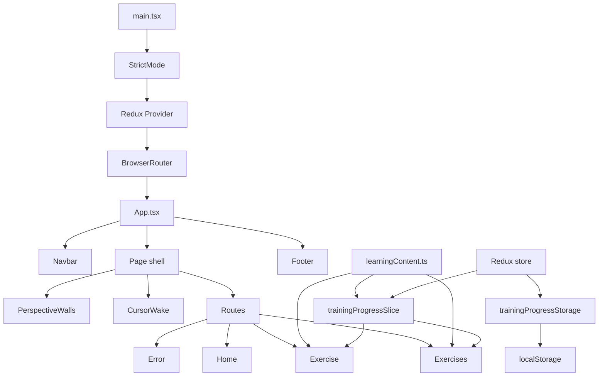
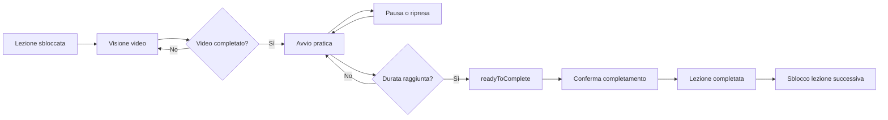
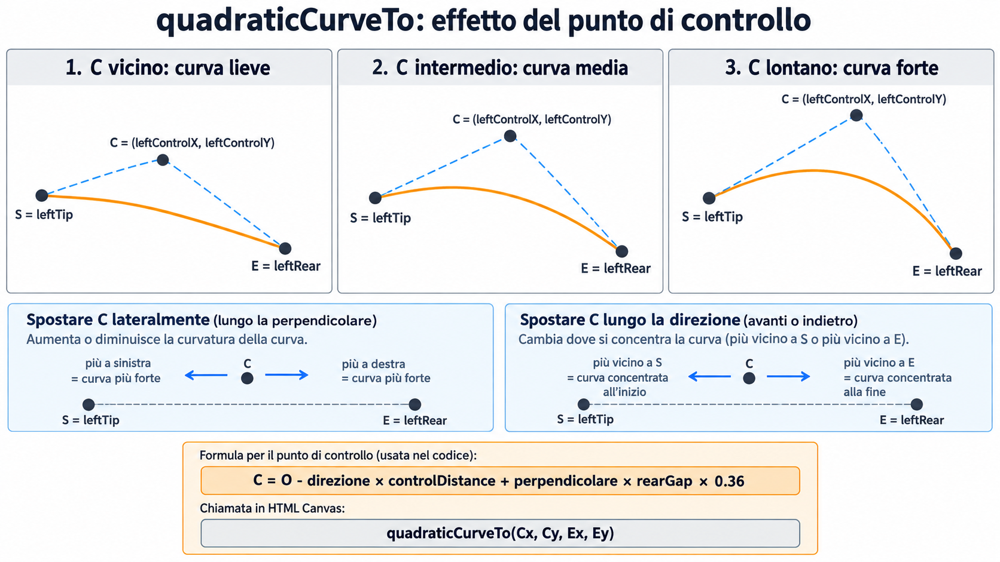

# MeditActive

[](https://react.dev/)
[](https://vite.dev/)
[](https://www.typescriptlang.org/)
[](https://redux-toolkit.js.org/)
[](https://getbootstrap.com/)
[](https://sass-lang.com/)
[](https://vitest.dev/)
[](https://playwright.dev/)

<p align="center">
  
</p>

Applicazione React dedicata alla meditazione, alla consapevolezza corporea e alla costruzione graduale di una pratica personale.

MeditActive è una **Single Page Application** responsive che propone lezioni video progressive, pratica temporizzata, controllo del completamento e persistenza locale dei progressi. L'interfaccia combina contenuti educativi, feedback visivo e un percorso sequenziale nel quale ogni esercizio sblocca il successivo.

---

## Indice

1. [Panoramica del progetto](#1-panoramica-del-progetto)
2. [Tecnologie utilizzate](#2-tecnologie-utilizzate)
3. [Funzionalità principali](#3-funzionalità-principali)
4. [Architettura generale](#4-architettura-generale)
5. [Struttura delle directory](#5-struttura-delle-directory)
6. [Routing dell'applicazione](#6-routing-dellapplicazione)
7. [Gestione dello stato con Redux](#7-gestione-dello-stato-con-redux)
8. [Modello dati degli esercizi](#8-modello-dati-degli-esercizi)
9. [Flusso di una lezione](#9-flusso-di-una-lezione)
10. [Persistenza e sincronizzazione](#10-persistenza-e-sincronizzazione)
11. [Componenti principali](#11-componenti-principali)
12. [Pagine principali](#12-pagine-principali)
13. [Stili, responsive design e animazioni](#13-stili-responsive-design-e-animazioni)
14. [Metadata e accessibilità](#14-metadata-e-accessibilità)
15. [Testing](#15-testing)
16. [Installazione e comandi](#16-installazione-e-comandi)
17. [Flussi applicativi](#17-flussi-applicativi)
18. [Note tecniche e possibili miglioramenti](#18-note-tecniche-e-possibili-miglioramenti)
19. [Appendice: effetto Canvas](#appendice-effetto-canvas)

---

## 1. Panoramica del progetto

**MeditActive** nasce per combinare meditazione, consapevolezza e strumenti di crescita personale in un'esperienza semplice da utilizzare.

L'app permette all'utente di:

- conoscere obiettivi, visione e missione del progetto;
- consultare un corso base di consapevolezza del corpo;
- seguire esercizi video dedicati a respirazione, postura e appoggio dei piedi;
- accedere alle lezioni secondo un ordine progressivo;
- avviare, mettere in pausa e riprendere una sessione temporizzata;
- verificare lo stato della lezione tramite una barra di avanzamento;
- conservare i progressi tra ricaricamenti e sessioni del browser;
- sincronizzare lo stato tra più schede dello stesso browser;
- ricevere una pagina di errore dedicata per rotte inesistenti o lezioni bloccate.

Il progetto è anche un esercizio pratico su:

- composizione di componenti React;
- routing statico e dinamico;
- modellazione dello stato con Redux Toolkit;
- side effect e timer tramite hook;
- persistenza nel browser;
- TypeScript e dati tipizzati;
- layout responsive con Bootstrap e Sass;
- testing unitario, d'integrazione ed end-to-end;
- accessibilità, metadata social e dati strutturati.

---

## 2. Tecnologie utilizzate

| Tecnologia | Ruolo nel progetto |
|---|---|
| React 19 | Componenti funzionali e rendering dell'interfaccia |
| TypeScript | Tipizzazione di componenti, dati, Redux e utility |
| Vite | Development server e tooling frontend |
| React Router DOM | Navigazione SPA e rotte dinamiche |
| Redux Toolkit | Stato condiviso del percorso di allenamento |
| React Redux | Collegamento tipizzato tra store e componenti |
| Bootstrap 5 | Griglia, utility responsive e componenti visuali |
| Sass / CSS | Variabili, media query, animazioni e personalizzazione Bootstrap |
| Canvas 2D API | Effetto decorativo associato al movimento del puntatore |
| Web Storage API | Persistenza locale e sincronizzazione tra schede |
| Vitest | Unit test in ambiente `jsdom` |
| Testing Library | Rendering e interazione nei test |
| Playwright | Test end-to-end su più browser |

Il `package.json` contiene anche dipendenze previste per evoluzioni future. La tabella riporta solamente le tecnologie effettivamente utilizzate dal codice attuale.

---

## 3. Funzionalità principali

### Home page

La pagina iniziale presenta:

- identità e obiettivo di MeditActive;
- problema affrontato, vision e mission;
- illustrazioni responsive;
- animazioni di ingresso attivate tramite `IntersectionObserver`.

### Percorso di esercizi

Il corso contiene cinque sezioni ordinate. La prima è disponibile immediatamente, mentre le successive vengono sbloccate al completamento della lezione precedente.

Le card mostrano:

- titolo e anteprima della lezione;
- stato di blocco;
- stato del video;
- stato della pratica;
- completamento dell'esercizio.

### Video e pratica temporizzata

Ogni lezione richiede due fasi:

1. visione completa del video;
2. pratica temporizzata con possibilità di pausa e ripresa.

L'app registra il tempo realmente riprodotto dal video tramite `HTMLMediaElement.played`, così un semplice spostamento del cursore temporale non equivale automaticamente al completamento.

### Progressione sequenziale

Il completamento di una sezione:

- aggiorna lo stato a `completed`;
- mantiene lo storico della lezione;
- sblocca esclusivamente la sezione indicata da `nextSectionId`;
- gestisce correttamente anche l'ultima sezione del corso.

### Esperienza responsive

Su schermi piccoli l'app usa una shell alta quanto la viewport:

- la navbar rimane in basso;
- il contenuto centrale gestisce lo scroll verticale;
- il layout si adatta tramite griglia Bootstrap e media query dedicate.

---

## 4. Architettura generale

L'applicazione segue un'architettura frontend organizzata per pagine, componenti, dati e stato condiviso.


```mermaid
flowchart TD
    A[main.tsx] --> B[StrictMode]
    B --> C[Redux Provider]
    C --> D[BrowserRouter]
    D --> E[App.tsx]

    E --> F[Navbar]
    E --> G[Page shell]
    E --> H[Footer]

    G --> I[PerspectiveWalls]
    G --> J[CursorWake]
    G --> K[Routes]

    K --> L[Home]
    K --> M[Exercises]
    K --> N[Exercise]
    K --> O[Error]

    P[learningContent.ts] --> M
    P --> N
    P --> Q[trainingProgressSlice]

    R[Redux store] --> Q
    Q --> M
    Q --> N
    R --> S[trainingProgressStorage]
    S --> T[localStorage]
```

### Responsabilità principali

| Livello | Responsabilità |
|---|---|
| `main.tsx` | Monta React, Redux e React Router |
| `App.tsx` | Definisce shell, decorazioni, navigazione, rotte e footer |
| `pages/` | Compone le pagine associate alle rotte |
| `components/` | Contiene UI e comportamenti riutilizzabili |
| `data/` | Contiene lezioni statiche, contenuti Home e metadata |
| `store/` | Gestisce stato, timer, persistenza e hook Redux tipizzati |
| `public/videos/` | Espone i video delle lezioni come asset pubblici |
| `tests/` | Contiene i test end-to-end Playwright |

---

## 5. Struttura delle directory

```text
MeditActiveReact/
├── docs/
│   └── curvature_regulation.png
├── public/
│   └── videos/
├── scripts/
│   └── ensure-linux-install.mjs
├── skills/
│   └── imagegen/
│       └── SKILL.md
├── src/
│   ├── assets/
│   │   ├── fonts/
│   │   └── img/
│   ├── components/
│   │   ├── exercise/
│   │   │   ├── article.tsx
│   │   │   ├── exerciseCard.tsx
│   │   │   └── exerciseView.tsx
│   │   ├── cursorWake.tsx
│   │   ├── footer.tsx
│   │   ├── navbar.tsx
│   │   ├── pageMetadata.tsx
│   │   ├── perspectiveWalls.tsx
│   │   ├── progressBar.tsx
│   │   └── title.tsx
│   ├── data/
│   │   ├── homeConcepts.tsx
│   │   ├── learningContent.ts
│   │   └── pageMetadata.ts
│   ├── pages/
│   │   ├── error.tsx
│   │   ├── exercise.tsx
│   │   ├── exercises.tsx
│   │   └── home.tsx
│   ├── store/
│   │   ├── hooks.ts
│   │   ├── store.ts
│   │   ├── timerHooks.ts
│   │   ├── trainingProgressSlice.ts
│   │   └── trainingProgressStorage.ts
│   ├── App.tsx
│   └── main.tsx
├── tests/
├── eslint.config.js
├── index.html
├── package.json
├── playwright.config.js
├── tsconfig.json
├── vite.config.js
└── vitest.config.js
```

Le directory `node_modules/`, `dist/`, `test-results/` e `playwright-report/` sono generate dagli strumenti di sviluppo e non fanno parte del codice sorgente.

---

## 6. Routing dell'applicazione

Il routing è definito in `App.tsx` tramite `Routes` e `Route`.

```tsx
<Routes>
  <Route path="/" element={<Home />} />
  <Route path="/exercises" element={<Exercises />} />
  <Route path="/exercise/:sectionId" element={<Exercise />} />
  <Route path="*" element={<Error />} />
</Routes>
```

| Rotta | Componente | Funzione |
|---|---|---|
| `/` | `Home` | Presentazione di MeditActive |
| `/exercises` | `Exercises` | Elenco delle lezioni e stato del percorso |
| `/exercise/:sectionId` | `Exercise` | Lezione dinamica identificata dalla sezione |
| `*` | `Error` | Pagina per rotte inesistenti |

La pagina `Exercise` valida `sectionId` tramite `isSectionId()`. Se l'identificativo non esiste o la sezione è ancora bloccata, viene mostrata la pagina di errore.

---

## 7. Gestione dello stato con Redux

Lo stato condiviso è gestito da Redux Toolkit nel dominio `trainingProgress`.

```ts
interface TrainingProgressState {
  progressBySectionId: Record<SectionId, SectionTrainingProgress>;
  activeSectionId: SectionId | null;
}
```

### Stato di una sezione

| Proprietà | Significato |
|---|---|
| `videoCompleted` | Indica se il video è stato guardato interamente |
| `videoCurrentSecond` | Posizione corrente salvata del video |
| `videoWatchedSeconds` | Tempo realmente riprodotto |
| `videoDurationSeconds` | Durata rilevata del video |
| `elapsedTrainingMs` | Tempo di pratica già accumulato |
| `requiredTrainingMs` | Durata richiesta dalla configurazione |
| `startedAtMs` | Timestamp di avvio della sessione corrente |
| `status` | Stato della pratica |
| `trainingCompleted` | Completamento definitivo della lezione |
| `isLocked` | Disponibilità della lezione nel percorso |

Gli stati possibili sono:

```text
idle → running → paused → running → readyToComplete → completed
```

### Azioni principali

| Azione | Responsabilità |
|---|---|
| `setVideoProgress` | Salva posizione, tempo riprodotto e durata |
| `setVideoCompleted` | Valida il completamento effettivo del video |
| `startVideoPlayback` | Registra la sezione multimediale attiva |
| `stopVideoPlayback` | Libera la sezione attiva |
| `startTraining` | Avvia o riprende la pratica |
| `pauseTraining` | Salva il tempo della sessione corrente |
| `setReadyToBeCompleted` | Porta la pratica alla fase di conferma |
| `completeTraining` | Completa la lezione e sblocca la successiva |
| `resetTraining` | Azzera il timer di una pratica completabile o completata |
| `synchronizeTrainingProgress` | Applica uno stato ricevuto da un'altra scheda |

`activeSectionId` impedisce l'esecuzione contemporanea di più sezioni nello stesso stato condiviso.

---

## 8. Modello dati degli esercizi

I contenuti statici sono definiti in `src/data/learningContent.ts` e rimangono separati dallo stato Redux.

```ts
interface ExerciseSection {
  readonly id: SectionId;
  readonly exerciseId: string;
  readonly title: string;
  readonly description: string;
  readonly videoUrl: string;
  readonly thumbnailUrl: string;
  readonly requiredTrainingMs: number;
  readonly nextSectionId: SectionId | null;
}
```

### Scelte di modellazione

- `as const` conserva gli identificativi come literal type;
- `SectionId` viene derivato direttamente dai dati;
- `exerciseSectionById` permette un accesso rapido tramite identificativo;
- `isSectionId()` agisce come type predicate;
- `nextSectionId` descrive la progressione senza duplicare la logica;
- dati statici e progresso utente restano separati.

Il percorso corrente comprende esercizi di respirazione da sdraiato, respirazione in piedi e consapevolezza dell'appoggio dei piedi.

---

## 9. Flusso di una lezione


```mermaid
flowchart LR
    A[Lezione sbloccata] --> B[Visione video]
    B --> C{Video completato?}
    C -- No --> B
    C -- Sì --> D[Avvio pratica]
    D --> E[Pausa o ripresa]
    E --> D
    D --> F{Durata raggiunta?}
    F -- No --> D
    F -- Sì --> G[readyToComplete]
    G --> H[Conferma completamento]
    H --> I[Lezione completata]
    I --> J[Sblocco lezione successiva]
```

### Timer

L'hook `useTrainingTimer()`:

- crea un intervallo soltanto durante lo stato `running`;
- aggiorna il tempo una volta al secondo;
- combina il tempo già salvato con la sessione corrente;
- limita il totale alla durata richiesta;
- invia `setReadyToBeCompleted` quando viene raggiunta la soglia;
- rimuove l'intervallo in pausa, al cambio sezione e allo smontaggio.

### Barra di avanzamento

`ProgressBar` visualizza quattro milestone:

```text
Inizio → Video → Pratica → Completato
```

Il valore viene passato al CSS tramite la custom property `--progress-value`.

---

## 10. Persistenza e sincronizzazione

Il progresso viene salvato nella chiave:

```text
meditactive-training-progress
```

### Scrittura

Lo store registra un subscriber che serializza `trainingProgress` dopo ogni cambiamento significativo.

```text
dispatch
  ↓
reducer
  ↓
nuovo stato Redux
  ↓
store.subscribe
  ↓
JSON.stringify
  ↓
localStorage
```

Gli errori di scrittura vengono intercettati per evitare che un problema del browser impedisca l'aggiornamento dell'interfaccia.

### Lettura

All'avvio, `loadTrainingProgress()` recupera il JSON salvato. Se la chiave è assente o il contenuto non è valido, Redux usa lo stato iniziale.

### Schede multiple

Il listener dell'evento `storage` intercetta gli aggiornamenti provenienti dalle altre schede e invia `synchronizeTrainingProgress()`.

---

## 11. Componenti principali

### `Navbar`

Gestisce la navigazione verso Home ed Exercises tramite `NavLink`, inclusi stato attivo e `aria-current`. Su mobile viene collocata nella parte inferiore della shell.

### `Footer`

Contiene contatti e collegamenti social. È condiviso da tutte le rotte.

### `Title`

Uniforma heading, colore, dimensione, allineamento e decorazioni animate, mantenendo configurabile il livello semantico da `h1` a `h6`.

### `ExerciseCard` e `Article`

Rappresentano una sezione del corso. Le lezioni sbloccate diventano link accessibili; quelle bloccate restano elementi informativi non navigabili.

### `ExerciseView`

Coordina:

- video e relativi eventi DOM;
- verifica del tempo realmente guardato;
- stato Redux;
- timer di pratica;
- pulsanti di avvio, pausa, reset e completamento;
- progress bar;
- navigazione alla sezione successiva.

### `PageMetadata`

Aggiorna titolo, description, robots, canonical URL, Open Graph e JSON-LD dell'organizzazione.

### `PerspectiveWalls` e `CursorWake`

Creano il livello decorativo dell'app. Le pareti prospettiche sono puramente visuali; il canvas reagisce al puntatore senza causare re-render React per ogni frame.

---

## 12. Pagine principali

### `Home`

Presenta MeditActive tramite contenuti strutturati in dati. Le sezioni vengono animate una sola volta quando entrano nella viewport; in assenza di `IntersectionObserver` restano comunque visibili.

### `Exercises`

Mostra il corso e genera le card partendo da `exerciseSections`.

### `Exercise`

Legge `sectionId` dalla URL, valida la sezione, controlla il blocco e crea metadata specifici prima di renderizzare `ExerciseView`.

### `Error`

Gestisce rotte inesistenti, identificativi non validi e accessi diretti a sezioni bloccate. Utilizza un'illustrazione coerente con lo stile MeditActive e metadata `noindex, nofollow`.

---

## 13. Stili, responsive design e animazioni

Gli stili sono organizzati in sorgenti Sass e corrispondenti file CSS:

| File | Responsabilità |
|---|---|
| `Colors.scss` | Palette principale |
| `BootstrapVars.scss` | Personalizzazione e inclusione Bootstrap |
| `Navbar.scss` | Navigazione desktop e mobile |
| `CustomElements.scss` | Card, progress bar e componenti personalizzati |
| `Animations.scss` | Reveal, livelli decorativi e animazioni |
| `App.scss` | Utility e regole globali |
| `App.css` | CSS importato dall'applicazione |

### Palette

| Colore | Valore | Uso |
|---|---|---|
| Arancione | `#e26a08` | Colore secondario e azioni |
| Verde scuro | `#3b6a4f` | Testi, immagini e atmosfera naturale |
| Verde chiaro | `#7fc87b` | Accenti e illustrazioni |
| Crema | `#fae3c0` | Sfondi e progress bar |
| Nero caldo | `#241d18` | Testo e contrasto |

### Layout mobile

Su mobile `.app-shell` occupa `100dvh`; la navbar è un elemento flex non comprimibile e `.page-scroll-container` gestisce lo scroll verticale. Questa struttura mantiene la navigazione visibile senza sovrapporla ai contenuti.

### Riduzione del movimento

Le animazioni rispettano `prefers-reduced-motion`. Il canvas viene attivato solamente quando sono disponibili puntatore preciso, hover e consenso alle animazioni.

---

## 14. Metadata e accessibilità

Ogni pagina definisce metadata dedicati:

- titolo;
- description;
- direttiva robots;
- canonical URL quando applicabile;
- proprietà Open Graph;
- immagine e testo alternativo social.

La Home aggiunge inoltre dati strutturati `Organization` in formato JSON-LD.

Tra le caratteristiche di accessibilità già presenti:

- heading configurabili semanticamente;
- testi alternativi per le immagini informative;
- `aria-label` per lezioni e video;
- `aria-current` per la navigazione;
- `role="progressbar"` e valori ARIA;
- `aria-hidden` per decorazioni e icone non informative;
- supporto a `prefers-reduced-motion`;
- lezioni bloccate non rese come link interattivi.

---

## 15. Testing

### Unit test con Vitest

I test in `src/**/*.test.js` coprono:

- integrità e relazioni dei dati didattici;
- stato iniziale Redux;
- avanzamento e completamento video;
- transizioni del timer;
- pausa, ripresa, reset e completamento;
- sblocco sequenziale;
- comportamento di `useTrainingTimer`;
- lifecycle e preferenze del canvas decorativo.

L'ambiente è `jsdom`, con setup condiviso in `vitest.setup.js`.

### Test end-to-end con Playwright

I test in `tests/` verificano:

- navigazione e routing;
- elenco e blocco delle lezioni;
- pagina esercizio e risorse video;
- esclusione della riproduzione simultanea;
- timer e completamento;
- progressione tra sezioni;
- persistenza nel `localStorage`;
- sincronizzazione e comportamento su reload;
- metadata e livelli decorativi.

La configurazione esegue i test su Chromium, Firefox e WebKit usando `http://localhost:5173`.

---

## 16. Installazione e comandi

### Prerequisiti

- ambiente Linux o WSL;
- Node.js;
- npm;
- browser moderno.

Lo script `preinstall` interrompe l'installazione eseguita direttamente con Node per Windows, evitando dipendenze native incompatibili con l'ambiente Linux del progetto.

### Clonazione e installazione

```bash
git clone https://github.com/FabryPostRock/MeditActiveReact.git
cd MeditActiveReact
npm install
```

### Avvio in sviluppo

```bash
npm run dev
```

Vite usa la porta fissa:

```text
http://localhost:5173/
```

### Script principali

| Comando | Funzione |
|---|---|
| `npm run dev` | Avvia Vite in sviluppo |
| `npm run typecheck` | Controlla TypeScript senza generare file |
| `npm run lint` | Esegue ESLint |
| `npm run lint:fix` | Applica le correzioni ESLint disponibili |
| `npm run format` | Formatta il repository con Prettier |
| `npm run format:check` | Controlla la formattazione |
| `npm run test` | Esegue una volta i test Vitest |
| `npm run test:watch` | Mantiene Vitest in watch mode |
| `npm run test:e2e` | Esegue Playwright |
| `npm run check` | Esegue typecheck, lint e format check |
| `npm run build:watch` | Mantiene TypeScript in modalità watch |
| `npm run preview` | Avvia la preview Vite sulla porta `4173` |

### Build di produzione

Attualmente `npm run build` esegue:

```bash
tsc -p tsconfig.json
```

Poiché `tsconfig.json` usa `noEmit: true`, il comando effettua il controllo TypeScript ma non produce il bundle Vite. Con la configurazione attuale, il bundle può essere generato usando la dipendenza Vite già installata:

```bash
npx vite build
npm run preview
```

L'output viene scritto in `dist/` e la preview usa `http://localhost:4173/`.

---

## 17. Flussi applicativi

### Avvio

```text
main.tsx
  ↓
StrictMode
  ↓
Redux Provider
  ↓
BrowserRouter
  ↓
App
```

### Navigazione

```text
Navbar
  ↓
Routes
  ↓
Home / Exercises / Exercise / Error
  ↓
Footer condiviso
```

### Progresso utente

```text
learningContent.ts
  ↓
trainingProgressSlice
  ↓
Redux store
  ↓
ExerciseCard / ExerciseView / ProgressBar
  ↓
trainingProgressStorage
  ↓
localStorage
```

### Completamento

```text
video completato
  ↓
pratica avviata
  ↓
timer raggiunto
  ↓
readyToComplete
  ↓
conferma utente
  ↓
completed
  ↓
sblocco nextSectionId
```

---

## 18. Note tecniche e possibili miglioramenti

### Script di build

Lo script `build` dovrebbe includere `vite build` se l'obiettivo è produrre direttamente il bundle frontend tramite `npm run build`.

### Messaggi dello script preinstall

`scripts/ensure-linux-install.mjs` contiene ancora alcuni riferimenti testuali al precedente progetto “Tongue”. Il controllo della piattaforma è valido, ma i messaggi e i percorsi suggeriti dovrebbero essere aggiornati a MeditActive.

### Copy della pagina errore nei test

Alcune asserzioni Playwright cercano ancora il precedente testo “Pagina Errore”, mentre la UI corrente mostra “Ops... qualcosa è andato storto...”. I test interessati devono essere riallineati al nuovo contenuto.

### Dipendenze

Il manifest include librerie non ancora importate dal codice corrente. Una revisione periodica può ridurre dimensione dell'installazione e superficie di manutenzione.

### Durata della pratica

La durata richiesta è attualmente configurata con un valore breve, utile durante sviluppo e test. Per un rilascio pubblico dovrebbe essere definita in base alla durata reale di ogni esercizio.

### Logging

Sono presenti `console.log()` diagnostici nel timer, nei reducer e nei componenti delle lezioni. Prima di una release pubblica conviene rimuoverli o limitarli all'ambiente di sviluppo.

### Sincronizzazione

La sincronizzazione tra schede può essere ulteriormente protetta con controlli espliciti contro aggiornamenti esterni equivalenti e cicli di riscrittura non necessari.

### Evoluzioni possibili

- profili utente e sincronizzazione remota;
- percorsi multipli di meditazione;
- durate configurabili;
- statistiche e storico delle sessioni;
- notifiche e promemoria;
- contenuti audio oltre ai video;
- pipeline CI per controlli e test multi-browser;
- audit periodici di accessibilità e prestazioni.

---

## Appendice: effetto Canvas

`CursorWake` usa un canvas a schermo intero per generare brevi increspature dietro al puntatore. React monta solamente il canvas; aggiornamento, disegno e cleanup sono gestiti direttamente tramite Canvas 2D API e `requestAnimationFrame`.

Il flusso corrente è:

```text
pointermove
  ↓
calcolo distanza, direzione e velocità
  ↓
creazione ripple
  ↓
requestAnimationFrame
  ↓
aggiornamento età, raggio e opacità
  ↓
rimozione ripple scaduti
```

Il diagramma seguente documenta uno studio geometrico precedente usato durante la calibrazione dell'effetto:

```text
x →
y ↓

        P ●  (leftX, leftY)
           ╲
            ╲     ramo sinistro della scia
             ╲
        C × · · ╲
          punto   ╲
          di       ● S  (leftTipX, leftTipY)
          controllo│
                   │ tipGap
                   └──────── ● T  (tipX, tipY)
                              │
                              │ tipDistance
                              │
                              ● O  (wave.x, wave.y)
                              ↓
                       movimento del mouse
```



---

## Riepilogo

MeditActive è una SPA React orientata alla pratica progressiva della consapevolezza corporea. Il progetto combina:

- routing con lezioni dinamiche;
- stato globale Redux tipizzato;
- timer con pausa e ripresa;
- video e verifica del tempo riprodotto;
- progressione sequenziale;
- persistenza locale e sincronizzazione tra schede;
- responsive design;
- metadata e accessibilità;
- unit test e test end-to-end.

La struttura mantiene separati contenuti statici, stato utente, componenti visuali e logica di persistenza, offrendo una base estendibile per futuri percorsi di meditazione e crescita personale.
