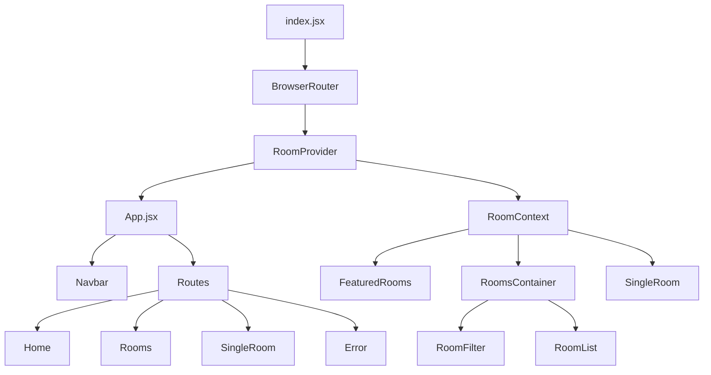

# Beach Resort React

[](https://react.dev/)
[](https://vite.dev/)
[](https://developer.mozilla.org/en-US/docs/Web/JavaScript)
[](https://developer.mozilla.org/en-US/docs/Web/CSS)
[](https://reactrouter.com/)
[](https://styled-components.com/)
[](https://nodejs.org/)
[](https://code.visualstudio.com/)

Applicazione frontend React per la presentazione e la consultazione di camere di un resort.

Il progetto implementa una **Single Page Application** con navigazione interna, pagina elenco camere, pagina dettaglio dinamica, filtri avanzati e gestione centralizzata dei dati tramite **React Context API**.

---

## Indice

1. [Panoramica del progetto](#1-panoramica-del-progetto)
2. [Tecnologie utilizzate](#2-tecnologie-utilizzate)
3. [Funzionalità principali](#3-funzionalità-principali)
4. [Architettura generale](#4-architettura-generale)
5. [Struttura delle directory](#5-struttura-delle-directory)
6. [Routing dell'applicazione](#6-routing-dellapplicazione)
7. [Gestione dello stato con Context API](#7-gestione-dello-stato-con-context-api)
8. [Modello dati delle camere](#8-modello-dati-delle-camere)
9. [Sistema di filtri](#9-sistema-di-filtri)
10. [Componenti principali](#10-componenti-principali)
11. [Pagine principali](#11-pagine-principali)
12. [Gestione degli stili](#12-gestione-degli-stili)
13. [Configurazione ambiente WSL e VS Code](#13-configurazione-ambiente-wsl-e-vs-code)
14. [Installazione e avvio](#14-installazione-e-avvio)
15. [Build di produzione](#15-build-di-produzione)
16. [Flusso applicativo](#16-flusso-applicativo)
17. [Note tecniche e possibili miglioramenti](#17-note-tecniche-e-possibili-miglioramenti)

---

## 1. Panoramica del progetto

**Beach Resort React** è un progetto frontend sviluppato con React per simulare il sito di un resort.

L'app permette all'utente di:

- visualizzare una home page con hero section, servizi e camere in evidenza;
- consultare l'elenco completo delle camere;
- filtrare le camere per tipologia, ospiti, prezzo, dimensione e servizi extra;
- aprire la pagina dettaglio di una singola camera tramite URL dinamico;
- visualizzare messaggi di errore in caso di rotta inesistente o camera non trovata.

Il progetto è pensato come esercizio pratico per comprendere:

- component composition;
- props;
- children;
- routing con React Router;
- gestione globale dello stato con Context API;
- form controllati;
- filtraggio dinamico di array;
- rendering condizionale;
- uso di CSS globale e CSS-in-JS.

---

## 2. Tecnologie utilizzate

| Tecnologia | Ruolo nel progetto |
|---|---|
| React | Creazione dell'interfaccia utente tramite componenti |
| React Router DOM | Gestione delle rotte SPA |
| Context API | Stato globale delle camere e dei filtri |
| JavaScript ES Modules | Import/export dei componenti e dei dati |
| JSX | Sintassi dichiarativa per componenti React |
| CSS3 | Stili globali, layout responsive e componenti UI |
| Styled Components | Hero dinamico con immagine di sfondo via props |
| React Icons | Icone della sezione servizi |
| Vite | Ambiente di sviluppo e build frontend |
| Node.js / npm | Runtime e gestione dipendenze |
| WSL | Ambiente Linux per sviluppo su Windows |
| VS Code | Workspace, task e configurazioni di sviluppo |

---

## 3. Funzionalità principali

### Home page

La home page mostra:

- hero principale;
- banner con call to action;
- sezione servizi;
- camere in evidenza.

### Pagina camere

La pagina camere mostra:

- hero dedicato;
- form di filtro;
- lista camere filtrata.

### Pagina dettaglio camera

Ogni camera possiede uno `slug` che viene usato per costruire una rotta dinamica:

```text
/rooms/:slug
```

Esempi:

```text
/rooms/single-economy
/rooms/family-deluxe
/rooms/presidential-room
```

### Filtri disponibili

L'utente può filtrare le camere per:

- tipologia;
- numero ospiti;
- prezzo massimo;
- dimensione minima;
- dimensione massima;
- colazione inclusa;
- animali ammessi.

---

## 4. Architettura generale

L'applicazione segue un'architettura frontend a componenti.



### Responsabilità principali

| Livello | Responsabilità |
|---|---|
| `index.jsx` | Monta l'app React nel DOM e avvolge `App` con router e provider |
| `App.jsx` | Definisce layout generale e rotte |
| `Context.jsx` | Prepara dati, stato globale, camere in evidenza e filtri |
| `pages/` | Contiene le pagine principali della SPA |
| `components/` | Contiene componenti riutilizzabili |
| `data.js` | Contiene i dati statici delle camere |
| `App.css` | Contiene lo stile globale dell'applicazione |

---

## 5. Struttura delle directory

Struttura principale del progetto, ricostruita dalla directory mostrata in VS Code:

```text
BeachResortReact/
├── .codex/
├── .vscode/
│   ├── backups/
│   ├── scripts/
│   ├── create-vite-react-js-project.sh
│   ├── create-vite-react-ts-project.sh
│   ├── extensions.json
│   ├── launch.json
│   ├── repair-native-dependencies-wsl.sh
│   ├── run-with-node.sh
│   ├── settings.json
│   ├── tasks.json
│   └── wsl-node-bashrc
├── dist/
├── node_modules/
├── public/
├── scripts/
├── src/
│   ├── components/
│   │   ├── Banner.jsx
│   │   ├── FeaturedRooms.jsx
│   │   ├── Hero.jsx
│   │   ├── Loading.jsx
│   │   ├── Navbar.jsx
│   │   ├── Room.jsx
│   │   ├── RoomFilter.jsx
│   │   ├── RoomList.jsx
│   │   ├── RoomsContainer.jsx
│   │   ├── Services.jsx
│   │   ├── StyledHero.jsx
│   │   └── Title.jsx
│   ├── images/
│   ├── pages/
│   │   ├── Error.jsx
│   │   ├── Home.jsx
│   │   ├── Rooms.jsx
│   │   └── SingleRoom.jsx
│   ├── App.css
│   ├── App.jsx
│   ├── Context.jsx
│   ├── data.js
│   ├── index.jsx
│   └── vite-env.d.ts
├── .gitattributes
├── .gitignore
├── .nvmrc
├── .prettierrc
├── eslint.config.js
├── index.html
├── package-lock.json
├── package.json
├── playwright.config.js
├── react_vite_project_wsl.code-workspace
├── todo.md
├── tsconfig.json
├── vite.config.js
└── vitest.config.js
```

### Note sulla struttura

| Cartella/File | Descrizione |
|---|---|
| `src/` | Codice sorgente React |
| `src/components/` | Componenti riutilizzabili |
| `src/pages/` | Pagine associate alle rotte |
| `src/images/` | Immagini delle camere, hero e loading |
| `src/data.js` | Dataset statico delle camere |
| `src/Context.jsx` | Provider globale dei dati |
| `src/App.jsx` | Routing principale |
| `.vscode/` | Configurazioni e task per VS Code |
| `dist/` | Output generato dalla build |
| `node_modules/` | Dipendenze installate localmente |
| `public/` | Asset statici pubblici |
| `.nvmrc` | Versione Node consigliata per l'ambiente WSL |
| `package.json` | Script npm e dipendenze |
| `vite.config.js` | Configurazione Vite |

> `dist/` e `node_modules/` sono cartelle generate e normalmente non dovrebbero essere versionate su Git.

---

## 6. Routing dell'applicazione

Il routing è definito in `App.jsx` tramite `Routes` e `Route`.

```jsx
<Routes>
  <Route path="/" element={<Home />} />
  <Route path="/rooms" element={<Rooms />} />
  <Route path="/rooms/:slug" element={<SingleRoom />} />
  <Route path="*" element={<Error />} />
</Routes>
```

| Rotta | Componente | Funzione |
|---|---|---|
| `/` | `Home` | Pagina iniziale |
| `/rooms` | `Rooms` | Elenco camere e filtri |
| `/rooms/:slug` | `SingleRoom` | Dettaglio camera dinamico |
| `*` | `Error` | Pagina 404 |

Il parametro dinamico `:slug` permette di aprire pagine diverse in base alla camera selezionata.

---

## 7. Gestione dello stato con Context API

La gestione globale dei dati avviene in `Context.jsx`.

```jsx
const RoomContext = createContext(null);
```

Il provider principale è:

```jsx
function RoomProvider({ children }) {
  return (
    <RoomContext.Provider value={{ ...state, getRoom, handleChange }}>
      {children}
    </RoomContext.Provider>
  );
}
```

In `index.jsx`, l'intera app viene avvolta con:

```jsx
<BrowserRouter>
  <RoomProvider>
    <App />
  </RoomProvider>
</BrowserRouter>
```

Questo permette a tutti i componenti discendenti di accedere allo stato delle camere.

### Stato iniziale

| Proprietà | Significato |
|---|---|
| `rooms` | Lista completa delle camere |
| `sortedRooms` | Lista camere filtrata |
| `featuredRooms` | Camere in evidenza |
| `loading` | Stato di caricamento |
| `type` | Filtro tipologia |
| `capacity` | Filtro numero ospiti |
| `price` | Filtro prezzo |
| `minPrice` | Prezzo minimo disponibile |
| `maxPrice` | Prezzo massimo disponibile |
| `minSize` | Dimensione minima disponibile |
| `maxSize` | Dimensione massima disponibile |
| `breakfast` | Filtro colazione |
| `pets` | Filtro animali |

---

## 8. Modello dati delle camere

I dati sono definiti in `data.js`.

Ogni camera ha una struttura simile a questa:

```js
{
  sys: {
    id: "1"
  },
  fields: {
    name: "single economy",
    slug: "single-economy",
    type: "single",
    price: 100,
    size: 200,
    capacity: 1,
    pets: false,
    breakfast: false,
    featured: false,
    description: "...",
    extras: ["Internet", "Comfortable beds"],
    images: [...]
  }
}
```

### Campi principali

| Campo | Tipo | Descrizione |
|---|---|---|
| `id` | string | Identificativo della camera |
| `name` | string | Nome commerciale della camera |
| `slug` | string | Identificatore usato nella rotta dinamica |
| `type` | string | Categoria della camera |
| `price` | number | Prezzo |
| `size` | number | Dimensione in SQFT |
| `capacity` | number | Numero massimo di ospiti |
| `pets` | boolean | Indica se gli animali sono ammessi |
| `breakfast` | boolean | Indica se la colazione è inclusa |
| `featured` | boolean | Indica se la camera è in evidenza |
| `description` | string | Descrizione testuale |
| `extras` | string[] | Lista servizi extra |
| `images` | array | Immagini della camera |

Nel provider, i dati vengono normalizzati con `formatData()`:

```jsx
let id = item.sys.id;
let images = item.fields.images.map((image) => image.fields.file.url);
let room = { ...item.fields, images, id };
```

Questa trasformazione produce oggetti più semplici da usare nei componenti.

---

## 9. Sistema di filtri

Il sistema di filtri è composto da tre parti:

1. stato globale in `Context.jsx`;
2. form controllato in `RoomFilter.jsx`;
3. rendering della lista filtrata in `RoomList.jsx`.

### Form dei filtri

`RoomFilter` riceve come props:

```jsx
{
  rooms,
  type,
  capacity,
  price,
  minPrice,
  maxPrice,
  minSize,
  maxSize,
  breakfast,
  pets,
  handleChange,
}
```

I campi del form usano `name` per indicare quale proprietà dello stato aggiornare.

```jsx
<select name="type" value={type} onChange={handleChange}>
```

```jsx
<input
  type="checkbox"
  name="breakfast"
  checked={breakfast}
  onChange={handleChange}
/>
```

### Gestione generica dell'evento

In `Context.jsx`, `handleChange()` legge:

```jsx
const { name, type, value, checked } = event.target;
```

Poi determina il valore corretto:

```jsx
let filterValue = type === 'checkbox' ? checked : value;
```

Per i campi numerici converte il valore con `Number()`.

```jsx
if (name === 'capacity' || name === 'price' || name === 'minSize' || name === 'maxSize') {
  filterValue = Number(filterValue);
}
```

Infine aggiorna lo stato usando una proprietà dinamica:

```jsx
[name]: filterValue
```

### Regole di filtraggio

I filtri applicati sono:

```jsx
if (nextState.type !== 'all') {
  filteredRooms = filteredRooms.filter((room) => room.type === nextState.type);
}

if (nextState.capacity !== 1) {
  filteredRooms = filteredRooms.filter((room) => room.capacity >= nextState.capacity);
}

filteredRooms = filteredRooms.filter((room) => room.price <= nextState.price);

filteredRooms = filteredRooms.filter(
  (room) => room.size >= nextState.minSize && room.size <= nextState.maxSize
);

if (nextState.breakfast) {
  filteredRooms = filteredRooms.filter((room) => room.breakfast === true);
}

if (nextState.pets) {
  filteredRooms = filteredRooms.filter((room) => room.pets === true);
}
```

Il risultato viene salvato in `sortedRooms`.

---

## 10. Componenti principali

### `Banner.jsx`

Componente riutilizzabile per mostrare titolo, sottotitolo e contenuto annidato.

```jsx
export default function Banner({ children, title, subtitle }) {
  return (
    <div className="banner">
      <h1>{title}</h1>
      <div></div>
      <p>{subtitle}</p>
      {children}
    </div>
  );
}
```

Usa `children` per ricevere elementi come link o pulsanti.

### `Hero.jsx`

Componente per la hero section.

```jsx
export default function Hero({ children, hero = 'defaultHero' }) {
  return <header className={hero}>{children}</header>;
}
```

La prop `hero` permette di cambiare classe CSS in base alla pagina.

### `StyledHero.jsx`

Componente basato su `styled-components`.

Serve a impostare dinamicamente l'immagine di sfondo della pagina dettaglio camera.

```jsx
const StyledHero = styled.header`
  min-height: 60vh;
  background: url(${(props) => (props.img ? props.img : defaultImg)}) center/cover no-repeat;
  display: flex;
  align-items: center;
  justify-content: center;
`;
```

### `Services.jsx`

Mostra una lista di servizi del resort.

Il componente definisce localmente un array `services` con:

- icona;
- titolo;
- descrizione.

Le icone sono importate da `react-icons/fa`.

### `FeaturedRooms.jsx`

Legge da `RoomContext` le camere in evidenza e le renderizza usando il componente `Room`.

```jsx
const { loading, featuredRooms } = useContext(RoomContext);
const rooms = featuredRooms.map((room) => <Room key={room.id} room={room}></Room>);
```

### `RoomsContainer.jsx`

È il componente contenitore della pagina camere.

Responsabilità:

- legge lo stato dal context;
- mostra `Loading` se necessario;
- passa i filtri a `RoomFilter`;
- passa le camere filtrate a `RoomList`.

### `RoomFilter.jsx`

Gestisce il form di ricerca camere.

Genera dinamicamente:

- opzioni per tipologia camera;
- opzioni per capacità;
- range prezzo;
- campi numerici per dimensione;
- checkbox per colazione e animali.

Usa una funzione helper:

```jsx
const getUnique = (items, value) => {
  return [...new Set(items.map((item) => item[value]))];
};
```

### `RoomList.jsx`

Mostra l'elenco delle camere filtrate.

Se non ci sono camere compatibili, mostra un messaggio di errore.

### `Loading.jsx`

Mostra un messaggio di caricamento e una GIF.

### `Navbar.jsx` e `Room.jsx`

Dalla struttura del progetto risultano presenti anche:

```text
Navbar.jsx
Room.jsx
```

Il loro contenuto non è stato incluso tra i file analizzati, ma il loro ruolo è ricavabile dall'uso nel progetto:

| Componente | Uso |
|---|---|
| `Navbar` | Importato in `App.jsx` e renderizzato sopra le rotte |
| `Room` | Usato da `FeaturedRooms.jsx` e `RoomList.jsx` per visualizzare una singola camera |

---

## 11. Pagine principali

### `Home.jsx`

La pagina iniziale compone:

- `Hero`;
- `Banner`;
- `Services`;
- `FeaturedRooms`.

### `Rooms.jsx`

La pagina camere compone:

- `Hero` con classe `roomsHero`;
- `Banner`;
- `RoomsContainer`.

### `SingleRoom.jsx`

Pagina dettaglio della singola camera.

Flusso:

1. legge `slug` dalla URL;
2. accede a `RoomContext`;
3. recupera la camera con `getRoom(slug)`;
4. se la camera non esiste, mostra errore;
5. se la camera esiste, mostra hero dinamico, immagini, dettagli e servizi extra.

```jsx
const { slug } = useParams();
const context = useContext(RoomContext);
const { getRoom } = context;
const room = getRoom(slug);
```

La hero usa la prima immagine della camera:

```jsx
<StyledHero img={images[0]}>
```

### `Error.jsx`

Pagina 404 per rotte non definite.

---

## 12. Gestione degli stili

Gli stili principali sono definiti in `App.css`.

### Variabili CSS

Il progetto usa variabili CSS globali:

```css
:root {
  --primaryColor: #af9a7d;
  --mainWhite: #fff;
  --offWhite: #f7f7f7;
  --mainBlack: #222;
  --mainGrey: #ececec;
  --darkGrey: #cfcfcf;
  --mainTransition: all 0.3s linear;
  --mainSpacing: 3px;
}
```

### Layout principali

Il CSS gestisce:

- reset globale;
- navbar fissa;
- hero responsive;
- banner;
- servizi;
- camere in evidenza;
- card camera;
- pagina dettaglio;
- lista camere;
- form di filtro.

### Responsive design

Sono presenti media query per adattare layout e griglie a diverse larghezze.

```css
@media screen and (min-width: 992px) {
  .featured-rooms-center {
    width: 95vw;
    max-width: 1170px;
  }
}
```

---

## 13. Configurazione ambiente WSL e VS Code

Dalla struttura del progetto risultano presenti file e script per lavorare in ambiente **WSL** con **VS Code**.

La cartella `.vscode/` contiene script e configurazioni per:

- creazione di progetti Vite React JS/TS;
- gestione del runtime Node in WSL;
- riparazione di dipendenze native in ambiente WSL;
- task automatici di VS Code;
- debug;
- suggerimento estensioni.

### Obiettivo della configurazione

Questi file servono a standardizzare lo sviluppo in ambiente Linux/WSL, evitando problemi frequenti come:

- uso accidentale di Node installato su Windows;
- dipendenze native installate per il sistema operativo sbagliato;
- configurazioni diverse tra terminale integrato e task VS Code;
- gestione non coerente della versione Node;
- problemi con `node_modules` copiato tra Windows e WSL.

---

## 14. Installazione e avvio

### Prerequisiti

- Node.js installato in WSL;
- npm;
- VS Code con estensione WSL;
- dipendenze npm installate nella cartella del progetto.

### Installazione dipendenze

Dalla root del progetto:

```bash
npm install
```

### Avvio in sviluppo

Per un progetto React + Vite, il comando tipico è:

```bash
npm run dev
```

Vite normalmente espone l'app su:

```text
http://localhost:5173/
```

Il valore esatto della porta deve essere verificato nell'output del terminale.

### Avvio tramite task VS Code

Se il workspace è configurato con task, è possibile usare:

```text
Terminal > Run Task...
```

e selezionare il task dedicato all'avvio del progetto.

---

## 15. Build di produzione

Per generare la build:

```bash
npm run build
```

L'output viene prodotto nella cartella:

```text
dist/
```

Per visualizzare localmente la build:

```bash
npm run preview
```

> I nomi degli script devono essere verificati nel file `package.json`.

---

## 16. Flusso applicativo

### Avvio app

```text
index.jsx
  ↓
createRoot(...)
  ↓
StrictMode
  ↓
BrowserRouter
  ↓
RoomProvider
  ↓
App
```

### Navigazione

```text
App.jsx
  ↓
Navbar sempre visibile
  ↓
Routes
  ↓
Home / Rooms / SingleRoom / Error
```

### Dati camere

```text
data.js
  ↓
Context.jsx
  ↓
formatData()
  ↓
state.rooms
  ↓
featuredRooms / sortedRooms
```

### Filtro camere

```text
RoomFilter
  ↓
onChange
  ↓
handleChange(event)
  ↓
aggiornamento dinamico dello stato
  ↓
filtri su rooms
  ↓
sortedRooms
  ↓
RoomList
```

### Dettaglio camera

```text
URL /rooms/:slug
  ↓
useParams()
  ↓
getRoom(slug)
  ↓
SingleRoom
  ↓
StyledHero + dettagli + extras
```

---

## 17. Note tecniche e possibili miglioramenti

### Validazione del Context

`SingleRoom.jsx` e `RoomsContainer.jsx` controllano il valore del context prima di usarlo.

```jsx
if (context === null) {
  throw new Error('SingleRoom deve essere utilizzato dentro RoomProvider');
}
```

Questa scelta rende più esplicito l'errore nel caso in cui un componente venga usato fuori dal provider.

### Stato derivato

`featuredRooms`, `minPrice`, `maxPrice`, `minSize` e `maxSize` vengono derivati dal dataset iniziale.

Questa soluzione è corretta per un dataset statico.

In caso di dati remoti da API, potrebbe essere utile gestire:

- loading reale;
- error state;
- retry;
- fetch asincrono;
- cache.

### Routing dinamico

La rotta:

```text
/rooms/:slug
```

rende il progetto più scalabile, perché non serve creare una pagina diversa per ogni camera.

### Possibile evoluzione backend

Attualmente i dati arrivano da `data.js`.

In una versione più avanzata, il dataset potrebbe essere sostituito da:

- API REST;
- database;
- Firebase;
- backend Node/Django/Laravel;

### Accessibilità

Possibili miglioramenti:

- testi `alt` più descrittivi;
- label corrette per tutti i campi form;
- stati focus più evidenti;
- gestione aria per menu mobile;
- contrasto colori verificato.

### Pulizia debug

Sono presenti alcuni `console.log()` utili in fase didattica.

Prima di una release pubblica, conviene rimuovere o limitare i log di debug.

---

## Riepilogo

Beach Resort React è una SPA didattica ma completa per comprendere un tipico flusso React:

- routing con pagine e URL dinamici;
- dati statici normalizzati;
- stato globale con Context;
- filtri controllati;
- rendering condizionale;
- componenti riutilizzabili;
- CSS globale responsive;
- CSS-in-JS con styled-components.

Il progetto è una buona base per studiare React Router, Context API, props, children, composizione di componenti e gestione di form controllati.
